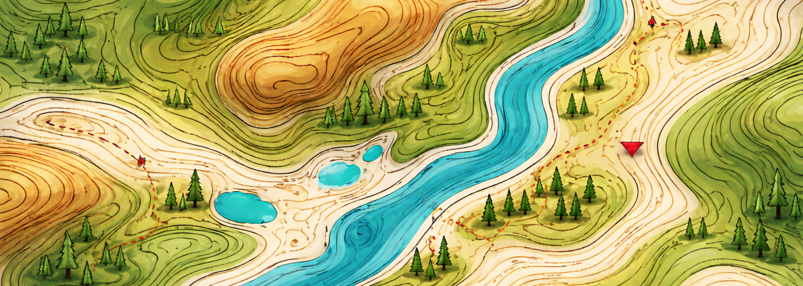

  

<h1 align="center">Pedro Pestana</h1>

🌍 Sistemas Geoespaciais e Engenharia de Dados

  Sou apaixonado por transformar dados geográficos em conhecimento acionável através de tecnologias <b>Open Source</b>. Especializo-me na utilização de QGIS, bases de dados espaciais e Python para análise e visualização de dados geográficos.

---

### 💻 Sobre Mim
- 🗺️ **O que faço:** Desenvolvimento de soluções SIG e análise espacial com foco em software livre.
- 🚀 **Foco Atual:** Automatização de workflows no QGIS com Python (PyQGIS) e gestão de dados no PostGIS.
- 🌐 **O meu portfólio:** Visita o meu site em [www.pedropestana.com](https://www.pedropestana.com).
- 🎓 **Área:** Geografia e Sistemas de Informação Geográfica.

---

### 🛠️ Toolbox Técnica (Open Source Focus)

#### **Sistemas de Informação Geográfica**
  

#### **Linguagens e Bases de Dados**
  

#### **Bibliotecas e Web Maps**
  

---

### 📊 Estatísticas de Código
*(Dados da minha conta unificada)*

  
  

---

### 📧 Vamos conversar?

  
  
  

---

  <i>“Everything is related to everything else, but near things are more related than distant things.” – Waldo Tobler</i>

